### Desktop

  <a href="https://github.com/nayutalienx/cursor-trail">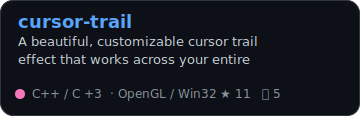</a>
  <a href="https://github.com/nayutalienx/clipgloss-overlay">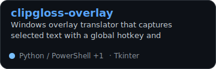</a>
  <a href="https://github.com/nayutalienx/securevol-windows">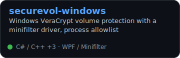</a>

### Automation

  <a href="https://github.com/nayutalienx/tunnel-fox">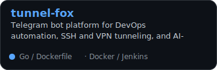</a>
  <a href="https://github.com/nayutalienx/docx-pdf-bot">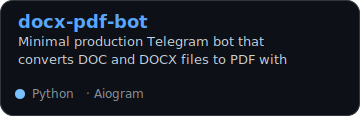</a>
  <a href="https://github.com/nayutalienx/ivbot">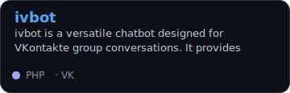</a>

### Tools

  <a href="https://github.com/nayutalienx/tfs-cli">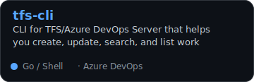</a>
  <a href="https://github.com/nayutalienx/go-import-cleaner">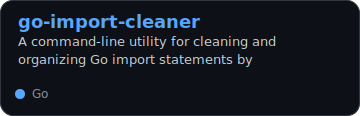</a>
  <a href="https://github.com/nayutalienx/openrouter-stt-proxy">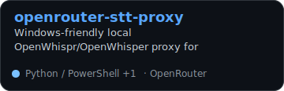</a>

  <a href="https://github.com/nayutalienx/osu-beatmap-downloader">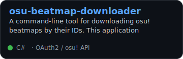</a>
  <a href="https://github.com/nayutalienx/osu-mp3-extracter">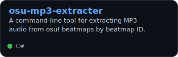</a>
  <a href="https://github.com/nayutalienx/osu-beatmaps-from-twitch-chat">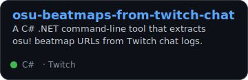</a>

### Games And Experiments

  <a href="https://github.com/nayutalienx/egks_app">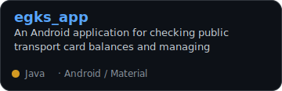</a>
  <a href="https://github.com/nayutalienx/vk-console">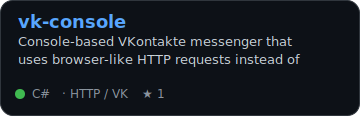</a>
  <a href="https://github.com/nayutalienx/ahasuerus">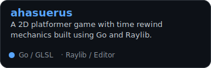</a>

  <a href="https://github.com/nayutalienx/project768">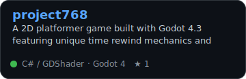</a>
  <a href="https://github.com/nayutalienx/braid-flyhack">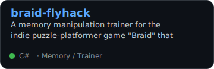</a>
  <a href="https://github.com/nayutalienx/asm_emulator">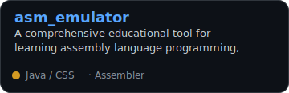</a>

